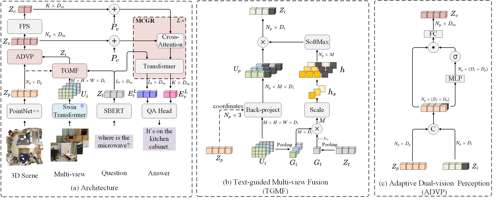

# DSPNet: Dual-vision Scene Perception for Robust 3D Question Answering

<p align="center"></p>

This is the official repository of **DSPNet: Dual-vision Scene Perception for Robust 3D Question Answering**, accepted by CVPR2025.
## 🏠 Abstract
 3D Question Answering (3D QA) requires the model to comprehensively understand its situated 3D scene described by the text, then reason about its surrounding environment and answer a question under that situation. However, existing methods usually rely on global scene perception from pure 3D point clouds and overlook the importance of rich local texture details from multi-view images. Moreover, due to the inherent noise in camera poses and complex occlusions, there exists significant feature degradation and reduced feature robustness problems when aligning 3D point cloud with multi-view images. In this paper, we propose a  **Dual-vision Scene Perception Network (DSPNet)**, to comprehensively integrate multi-view and point cloud features to improve robustness in 3D QA. Our Text-guided Multi-view Fusion (TGMF) module prioritizes image views that closely match the semantic content of the text. 
 To adaptively fuse back-projected multi-view images with point cloud features, we design the Adaptive Dual-vision Perception (ADVP) module, enhancing 3D scene comprehension. Additionally, our Multimodal Context-guided Reasoning (MCGR) module facilitates robust reasoning by integrating contextual information across visual and linguistic modalities. Experimental results on SQA3D and ScanQA datasets demonstrate the superiority of our DSPNet.

## 📚 Installation

Please refer to [installation guide](docs/installation.md).

## 📋 Dataset

Please refer to [data preparation](docs/dataset.md) for preparing the ScanNet v2, ScanQA and SQA3D datasets.
## 🤖 Usage

### Training
- (Optional) Start training the poinnet++ in the object detection task of scannet dataset, or you can directly download the checkpoint. We found that the lack of pretraining for PointNet++ has little impact on the ScanQA and SQA task.
  ```shell
    CUDA_VISIBLE_DEVICES=0,1,2,3 torchrun --nproc_per_node=4 tools/train.py \
    configs/scannet-det/scannet-votenet-12xb12.py --work-dir=work_dirs/scannet-det/scannet-votenet --launcher pytorch
  ```

- Training DSPNet on ScanQA task:
  ```shell
    CUDA_VISIBLE_DEVICES=0,1,2,3 torchrun --nproc_per_node=4 tools/train.py \
    configs/scanqa/mv-scanqa-pointnetpp-swin-sbert-12xb12.py --work-dir=work_dirs/mv-scanqa/mv-scanqa-pointnetpp-swin-sbert-12xb12 --launcher pytorch
  ```

- Training DSPNet on SQA task:
  ```shell
    CUDA_VISIBLE_DEVICES=0,1,2,3 torchrun --nproc_per_node=4 tools/train.py \
    configs/sqa/mv-sqa-pointnetpp-swin-sbert-12xb12.py --work-dir=work_dirs/mv-sqa/mv-sqa-pointnetpp-swin-sbert-12xb12 --launcher pytorch
  ```
- For ease of analysis, we incorporate the evaluation into the end of each `interval` epochs of training.
### Inference
- Evaluation of trained models with the ScanQA test dataset:

  ```shell
    CUDA_VISIBLE_DEVICES=0,1,2,3 torchrun --nproc_per_node=4 tools/test.py \
    configs/scanqa/mv-scanqa-pointnetpp-swin-sbert-12xb12.py work_dirs/mv-scanqa/mv-scanqa-pointnetpp-swin-sbert-12xb12/best_EM@1_epoch_<epoch_id>.pth \ 
    --work-dir=work_dirs/scanqa_test_w_object  --launcher pytorch
  ```

- The [ScanQA benchmark](https://eval.ai/web/challenges/challenge-page/1715/overview) is hosted on [EvalAI](https://eval.ai/). 
Please submit the `work_dirs/scanqa_test_{split}/test_result.json` to this site for the evaluation of the test with and without objects. You can set up the test split by modifying the `ann_file` and `qa_file` of `test_dataloader` in [`mv-scanqa-pointnetpp-swin-sbert-12xb12.py`](configs/scanqa/mv-scanqa-pointnetpp-swin-sbert-12xb12.py).


- Evaluation of trained models with the SQA3D test dataset:

  ```shell
    CUDA_VISIBLE_DEVICES=0,1,2,3 torchrun --nproc_per_node=4 tools/test.py \
    configs/sqa/mv-sqa-pointnetpp-swin-sbert-12xb12.py work_dirs/mv-sqa/mv-sqa-pointnetpp-swin-sbert-12xb12/best_EM@1_epoch_<epoch_id>.pth \ 
    --work-dir=work_dirs/sqa_test  --launcher pytorch
  ```

- Due to the inherent randomness of multi-gpu distribution, the re-evaluation results may be slightly different from the evaluation results during training (We use the evaluation results during training in our report).

## 📦 Checkpoints

| Checkpoint           | Link                                                         | Note                                              |
| :------------------- | ------------------------------------------------------------ | ------------------------------------------------- |
| VoteNet  | [link](https://drive.google.com/file/d/1OTj-q4aPmsAg0rSq8T3uqCEUHXuCRQtb/view?usp=drive_link) | VoteNet Pre-trained on ScanNet.                  |
| DSPNet-ScanQA       | [link](https://drive.google.com/file/d/1IZs0G8Nt5YAH4fCF3vIZMYQAnkPea-1T/view?usp=drive_link) | Trained on ScanQA.    |
| DSPNet-SQA          | [link](https://drive.google.com/file/d/1GZcPQdWkaBqRAcAZkWAASGNDwJ7WD3gA/view?usp=drive_link) | Trained on SQA.       |


## 🔗 Citation
If you find our work helpful for your research. Please consider citing our paper.
```BibTex
@misc{luo2025dspnet,
      title={DSPNet: Dual-vision Scene Perception for Robust 3D Question Answering}, 
      author={Jingzhou Luo and Yang Liu and Weixing Chen and Zhen Li and Yaowei Wang and Guanbin Li and Liang Lin},
      year={2025},
      eprint={2503.03190},
      archivePrefix={arXiv},
      primaryClass={cs.CV},
      url={https://arxiv.org/abs/2503.03190}, 
}
```
## 📄 License

<a rel="license" href="http://creativecommons.org/licenses/by-nc-sa/4.0/"></a>
<br />
This work is under the <a rel="license" href="http://creativecommons.org/licenses/by-nc-sa/4.0/">Creative Commons Attribution-NonCommercial-ShareAlike 4.0 International License</a>.

## 👏 Acknowledgements
We would like to thank [EmbodiedScan](https://github.com/OpenRobotLab/EmbodiedScan) for the codebase of 3D training pipeline and [mmdetection3d](https://github.com/open-mmlab/mmdetection3d) for the codebase of pointnet++ and votenet.